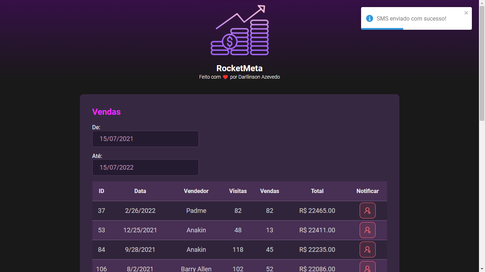

  

  

  

  

## 💻 Projeto

O objetivo da aplicação é fazer o controle de vendas de uma empresa, notificando os vendedores sobre o valor vendido e quem foi o destaque do mês.

Você pode visitar a aplicação [clicando aqui](https://rocketmeta.netlify.app)

## ✨ Tecnologias e features

### Front-end Web

- [ ] Vite
- [ ] TypeScript
- [ ] ReactJS
- [ ] React Date Picker
- [ ] Toastify
- [ ] Axios

### Back-end

- [ ] Java
- [ ] Spring Initializr
- [ ] Twilio SMS API
- [ ] SQL Database

## 📄 Licença

Esse projeto está sob a licença MIT. Veja o arquivo [LICENSE](.github/LICENSE.md) para mais detalhes.
